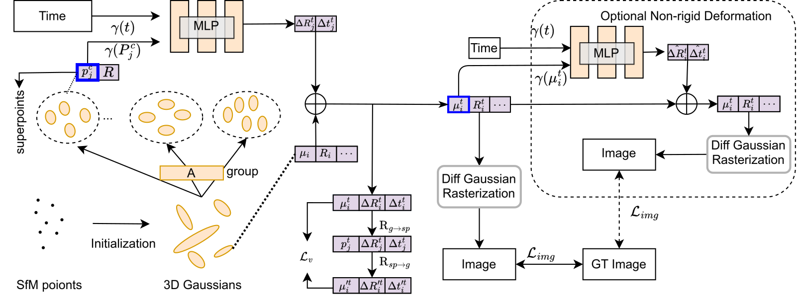

# Superpoint Gaussians Splatting for Real-Time High-Fidelity Monocular Dynamic Scene Reconstruction

## [Project page](https://dnvtmf.github.io/SP_GS.github.io/) | [Paper](https://arxiv.org/abs/2406.03697)

This repository contains the official implementation associated with the paper "Superpoint Gaussians Splatting for Real-Time High-Fidelity Monocular Dynamic Scene Reconstruction".

## Dataset

In our paper, we use:

- synthetic dataset from [D-NeRF](https://www.albertpumarola.com/research/D-NeRF/index.html)
- real-world dataset from [NeRF-DS](https://jokeryan.github.io/projects/nerf-ds/) and [Hyper-NeRF](https://hypernerf.github.io/) .

We organize the datasets as follows:

```shell
├── data
│   ├── D-NeRF 
│   │  ├── hook
│   │  ├── standup 
│   │  ├── ...
│   ├── NeRF-DS
│   │  ├── as
│   │  ├── basin
│   │  ├── ...
│   ├── HyperNeRF
│   │  ├── interp
│   │  ├── misc
│   │  ├── virg
```

## Pipeline



## Run

### Environment

```shell
git clone https://github.com/dnvtmf/SP_GS --recursive
cd SP_GS

conda create -n sp_gs_env  # python>=3.8
conda activate sp_gs_env

# install pytorch
pip install torch torchvision torchaudio

# install dependencies
pip install -r requirements.txt
```

### Train

```shell
python train.py -s <path/to/your/dataset> -m <output/exp-name> --eval
```

### Render & Evaluation

```shell
python render.py -m <output/exp-name>
python metrics.py <-m output/exp-name>
```

We provide several modes for rendering:

- `render`: render all the test images
- `time`: time interpolation tasks for D-NeRF dataset
- `all`: time and view synthesis tasks for D-NeRF dataset
- `view`: view synthesis tasks for real-world dataset
- `original`: time and view synthesis tasks for real-world dataset

#### Visualization

```
python gui_edit.py
```

Then, click
`Add Model` button to choose trained model, you can choose

- ".ply" file (e.g., "output/NeRF_DS/as/point_cloud/iteration_40000/point_cloud.ply),
- ".pth" file (e.g., "output/NeRF_DS/as/point_cloud/iteration_40000/point_cloud.ply")

## BibTex

```
@InProceedings{SP-GS,
  title = 	 {Superpoint Gaussian Splatting for Real-Time High-Fidelity Dynamic Scene Reconstruction},
  author =       {Wan, Diwen and Lu, Ruijie and Zeng, Gang},
  booktitle = 	 {Proceedings of the 41st International Conference on Machine Learning},
  pages = 	 {49957--49972},
  year = 	 {2024},
}

```

And thanks to the authors of [Deformable-3D-Gaussians](https://github.com/ingra14m/Deformable-3D-Gaussians) and  [3D Gaussians](https://repo-sam.inria.fr/fungraph/3d-gaussian-splatting/) for their excellent code, please consider also cite this repository:

```
@article{yang2023deformable3dgs,
    title={Deformable 3D Gaussians for High-Fidelity Monocular Dynamic Scene Reconstruction},
    author={Yang, Ziyi and Gao, Xinyu and Zhou, Wen and Jiao, Shaohui and Zhang, Yuqing and Jin, Xiaogang},
    journal={arXiv preprint arXiv:2309.13101},
    year={2023}
}

@Article{kerbl3Dgaussians,
      author       = {Kerbl, Bernhard and Kopanas, Georgios and Leimk{\"u}hler, Thomas and Drettakis, George},
      title        = {3D Gaussian Splatting for Real-Time Radiance Field Rendering},
      journal      = {ACM Transactions on Graphics},
      number       = {4},
      volume       = {42},
      month        = {July},
      year         = {2023},
      url          = {https://repo-sam.inria.fr/fungraph/3d-gaussian-splatting/}
}
```

